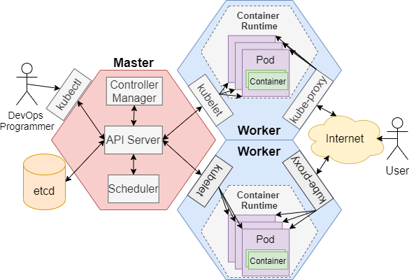
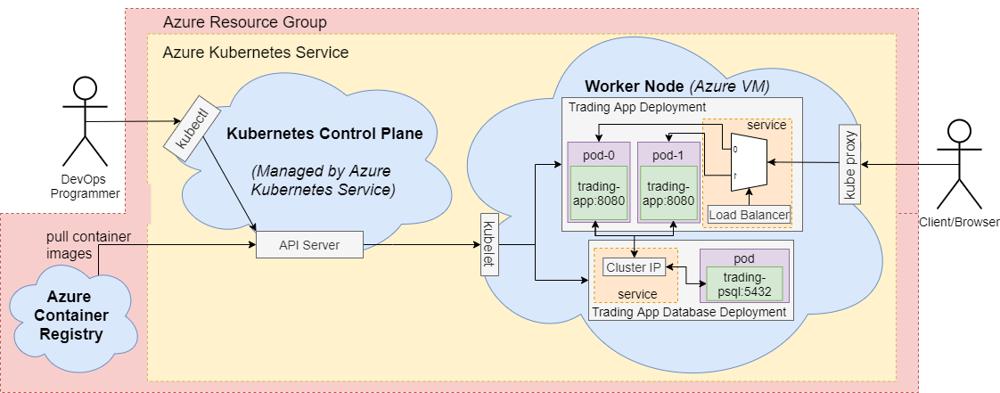

# Introduction
This project deploys a [microservice-based stock trading application](https://github.com/jarviscanada/jarvis_data_eng_KevinShimotakahara/tree/develop/springboot) in two different Kubernetes clusters provisioned by Microsoft Azure Kubernetes Service (AKS) that are maintained with Jenkins Continuous Integration/Continuous Development (CI/CD) pipelines. These clusters provide two distinct "development (dev)" and "production (prod)" environments to practice DevOps paradigms. With the help of Kubernetes, this project is capable of delivering a sophisticated deployment environment that enables our application to be self-healing during contingencies; adaptive to fluctuations in user demand by ensuring that an appropriate number of replicas are running; and capable of evenly distributing workloads across application replicas.

This is a proof-of-concept project aimed at validating the plan to migrate Jarvis' on-premise servers to the Microsorft Azure cloud. 

# Application Architecture
Describing this project's architecture first requires a general architectural description of Kubernetes. Kubernetes is a "container orchestrator", which means it organizes the dispatch of containerized applications/microservices to a distributed system of machines. Kubernetes operates in a master-worker architecture:

There is a single master node responsible for managing the deployment of containerized applications among the one or more worker nodes in the Kubernetes cluster. Some of the master node's responsibilities include the following:
 - Scheduling the dispatch of new applications/microservices as "pods", which are Kubernetes-control-plane-infused collections of the tightly coupled containers that run your code
 - Monitoring dispatched pods to ensure they are healthy
 - Horizontally scaling containerized applications/microservices by adding/removing replicas of the pods running such microservices as required
 - Performing rolling updates on existing sets of replicated microservices

The master node consists of the following main components:
 - **Controller Manager:** Controllers are threads running background tasks. There are different kinds of controllers named after the system component that they control, namely the Node, Replication, and End-Point controllers, which deal with worker states, pod replications, and service-to-pod connectivity respectively (more on services later).
 - **Scheduler:**  The scheduler figures out where to place pods among your worker nodes based on the current state of the nodes. With each pod, the scheduler takes into consideration their "predicates" and "priorities". Predicates are a mix of system supplied and user supplied constraints that the scheduler must respect while making a pod placement decision, e.g. minimum memory required on the node it will be running in, etc. Priorities are softer design objectives that give an idea of what the pod values in a worker node, enabling it to make the best placement choice among the feasible options remaining after predicate constraints have been taken into consideration.
 - **API Sever:** This is the "front end" of Kubernetes control plane, i.e. it is the interface a system designer uses to set up/observe/manage a Kubernetes cluster. Kubernetes allows us to pass high level commands to its API Server via the `kubectl` command.
 - **etcd:** This is Kubernete's database, which is a key value store; it stores the cluster data required for Kubernetes to function, e.g. job scheduling info, pod details, stage information.

The applications/microservices managed by the master are run on the worker nodes; each worker node is a physical or virtual machine. A worker node consists of the following main components:
 - **Kubelet:** The master uses its API server to speak to a worker node's "kubelet", which is an agent that waits for it to be told to add/remove pods.
 - **Container Runtime:** This refers to the software that creates the containers you build/fill pods with.
 - **Pods:** Pods are groups of containers that share storage, Linux name space, IP addresses, etc. A pod represents one running process in the cluster, and is the smallest unit of stuff that can be interacted with in the cluster.
 - **Kube Proxy:** Essentially, a worker node's kube proxy deals with communication between pods and external entities like internet users.

# Jenkins CI/CD pipeline
Moreover, a Jenkins helm chart was deployed on a separate Minikube Kubernetes cluster, allowing us to use Jenkins to automate the integration and deployment of our codebase to the AKS cluster when updates to it are made. Using Jenkins in this manner is commonly referred to as building a Continuous Integration, Continuous Deployment (CI/CD) pipeline.
- Describe your CI/CD pipeline (e.g. git clone, build, test, deploy)
- Describe your Jenkins CI/CD pipeline
- Visualize your Ci/CD pipeline with a diagram

# Improvements
1. Implement an automated deployment rollback mechanism (e.g. [blue/green](https://martinfowler.com/bliki/BlueGreenDeployment.html))
2. Design a deployment scheduler in Jenkins to make the CI/CD pipeline provision true Continuous Deployment
3.
