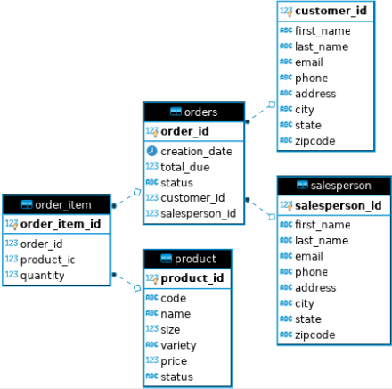

# Introduction
This application sets up a connection via the JDBC API 
to a PostGreSQL database that manages a business' customer
and order records. The core concept of this project was to
develop objects that can streamline the process of building
Strings that contain SQL statements which can be fed to JDBC
APIs, whereupon the PostGreSQL driver that implements the
JDBC interfaces can forward the SQL statements to the
database application, and receive its response.

Two different Data Access Objects (DAO) were created, one each
for interacting with the Customer and Order data tables
in the database. These DAOs leveraged JDBC libraries to 
facilitate simple SQL query, update, and insert statements
specified by a Java client. Data Transfer Object classes
were also designed for passing information between the DAOs
and the business logic code.

# ER Diagram
Below is a diagram depicting the relationships among tables
in the database this application interacts with.

# Design Patterns
Design patterns offer a formal way to characterize the manner
in which the class you design to leverage the JDBC
drivers should operate. Two widely recognized design patterns
include the Data Access Object (DAO), and Repository patterns.

The Data Access Object pattern is designed to send potentially
sophisticated queries to the database, where the database
application is expected to perform join operations and
return a complete query back to the Java application.

The Repository pattern limits the queries that your Java
application can send to the database to those that only
pull data from a single table. In this pattern, the object
collects the data it needs table by table
(placing the data in a "repository"), and if any join
operations are required, they are performed in the Java
environment.

The Repository pattern is better for distributed databases 
because if your database is fragmented across many nodes, 
it cannot perform join operations, as joins rely on 
having a complete instance of a database on a single node. 
Thus, since the Repository pattern does not rely on the 
database to perform join operations, it can still function, 
whereas DAOs cannot.

If the data in a database is highly normalized, then join 
operations are efficient to perform by the database. 
As such, the DAO pattern is best because it takes advantage 
of the efficient operations the database can perform at the 
source.

In our project's case, the database is well normalized and
centralized, so the use of DAOs made sense. 