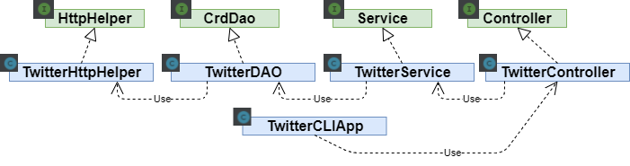

# Introduction
This application allows a user to post, read, and delete
Tweets from the Linux Command Line Interface. Our Dockerized
Java program accepts a Twitter Developer's OAuth 1.0 credentials
needed to be serviced by the Twitter REST API, in addition to
the information about the post/show/delete Tweet action
to be performed as command line inputs. The application then
proceeds to contact the Twitter API to fulfill the request,
and prints the JSON file(s) containing information about the
Tweets that the user just posted/read/deleted.

This project was a rich learning experience, introducing the
following essential programming concepts: 

- Unit/Integration testing with Mockito/JUnit
- Dependency Management with Spring
- Organizing project build workflow with Maven
- Modularizing the functionality of the application as per
  the Model View Controller (MVC) software development design
  pattern
- Reading and writing RESTful Http responses and requests
- Data parsing and marshalling techniques

# Quick Start
## Prerequisite Files and Applications
The Docker image used to run this application is available 
at https://hub.docker.com/repository/docker/kshimotakahara/twitter.
You can either pull this image directly, or build the Dockerfile included
in the root directory of this repository.

Also, this is a Maven project, and we use Maven commands to build it,
so make sure you have Maven installed on your system.

## Step 1: Package Source Code Into .jar File With Maven
After cloning this repository to your system, navigate to its root
directory (.../twitter), and execute the following command:

`mvn clean package`

This command should generate a .jar file that the Docker container will
use to run the application. If the project was built successfully,
you will find in the /twitter/target/ directory a file called
"twitter-1.0-SNAPSHOT.jar".

## Step 2: Running the Application with Docker
Provided you built or pulled the Docker image, you can use it with
a command like the following:

### For Posting a Tweet
``` shell script
docker run --rm \
-e consumerKey=your_consumerKeyHere \
-e consumerSecret=your_consumerSecretHere \
-e accessToken=your_accessTokenHere \
-e tokenSecret=your_tokenSecretHere \
kshimotakahara/twitter post "tweet text here" "latitude:longitude"
```
You replace "latitude" and "longitude" with the numerical values of your
geographical location. Make sure the account you are posting to has
enabled the option to add location information to its Tweets. You can
change this setting under Settings/Privacy and safety/Location Information
on your Twitter account.

### For Reading a Tweet
``` shell script
docker run --rm \
-e consumerKey=your_consumerKeyHere \
-e consumerSecret=your_consumerSecretHere \
-e accessToken=your_accessTokenHere \
-e tokenSecret=your_tokenSecretHere \
kshimotakahara/twitter show id [field1,field2,...]
```
Here, `id` is the Tweet id of the Tweet you want to show.
The show command has the optional input `[field1,field2,...]`,
which you can use to limit the Tweet object data fields returned
by the application to the fields you specify in a list of field names.

### For Deleting Tweet(s)
``` shell script
docker run --rm \
-e consumerKey=your_consumerKeyHere \
-e consumerSecret=your_consumerSecretHere \
-e accessToken=your_accessTokenHere \
-e tokenSecret=your_tokenSecretHere \
kshimotakahara/twitter delete [id1,id2,...]
```
The delete command allows one to delete several tweets at once,
and because of this, you must pass a list of Tweet ids that identify
to the application the tweets you want to delete.

For each of the three different commands you can call, you always
must pass to the container four environment variables containing
your OAuth 1.0 credentials (e.g. replace "your_consumerKeyHere" with
the API key of your Twitter Developer account).

# Design
## UML Diagram

## MVC Class Overview
This project follows an MVC design pattern; however, we do
not implement a "View" component, and only print JSON files
received from the API in the command line. The MVC design
pattern can be thought of as modelling your application as
an application stack, where each layer is implemented with its
own dedicated class. The different layers specified in the MVC
design pattern (that we implement) are
the Controller layer, the Service layer, and the Data Access
Object (DAO) layer. Moreover, we developed an "Application" layer
on top of the MVC architecture that interfaces the CLI with the
services that the MVC components provide. 
A brief description of the general role
of each layer followed by what actions these principles
translated to in our implementation is included below.

### TwitterCLIApp (Application layer)
This class manages all the dependencies of the various classes
developed in this project, so it can instantiate the final
application class whose methods can be used to send requests
to the Twitter API. This class contains our project's "main" method,
which is called to execute our application.
It accepts the arguments fed to it by the user through the CLI,
reading the requested command to be executed (i.e. "post", 
"show", or "delete"), and calling the appropriate method of
the MVC controller object (TwitterController). the Tweet
object(s) returned by the controller then get(s) printed
in JSON format.

### TwitterController (MVC Controller Layer)
In general, an MVC Controller is responsible
for processing the user input into a format
that can be understood by the Service layer.

In our application, we designed a class called
TwitterController, which parses information 
contained within the input Strings that were
forwarded from the CLI by the Application layer.
For example, when a "post" command is received,
the controller must extract the
status update text and coordinate data from the
input argument String Array, and use it to populate a
new Tweet object's text
and coordinate fields. Then, the controller
passes the Tweet object to the service layer for further
processing.

### TwitterService (MVC Service Layer)
In general, the MVC Service layer handles the "business 
logic" of the application, which is essentially all the
code that generates the value of the application (e.g.
it performs data analytics calculations, decides how to
respond to the user's input, etc.)

The MVC Service layer is best described in terms of what
it *doesn't* do. First, it is not responible for 
interpreting the user inputs; it relies on the Controller
to tell it what functions to execute, and the arguments
it should use. Information is exchanged between the Controller
layer and Service layer via Data Transfer Objects (DTOs).

Second, it is not responsible for interacting
with the data resources that are used in the project; if
the service layer needs to give/take data to/from a
resource (a REST server in this case), it uses the services
of the DAO layer by sending/receiving data to/from it
in the form of "Data Access Objects (DAOs)". This way,
the business logic code is not cluttered with low level
data access and input parsing code, making it easier to
focus on the actual problem the application is trying to
solve.

In our case, the business logic is simple. TwitterService
performs some basic data validation operations (e.g. confirms
the status update is 140 characters or less prior to posting
the tweet, confirms the coordinates are valid, etc.), and
also filters Tweet objects returned by the "show" operation
to contain only the data fields that the user specifies with
the "fields" input parameter. Also, DAOs and DTOs have the same
structure in this project, namely the Tweet object.

### TwitterDAO (MVC DAO Layer)
In general, the MVC DAO layer is responsible for:
1. Accepting Data Access Objects from the Service layer,
and relaying them to the appropriate data resource (in this
case, the Twitter REST API).
2. Extracting data desired by the Service layer from the
appropriate resource (in this case, the Twitter REST API),
wrapping it in a Data Access Object, and giving it to the
Service layer.

In this project, the TwitterDAO class was designed to implement
the DAO layer, and leverages HttpClient objects to interact
with the REST API. TwitterDAO is capable of generating the URI
needed to feed to the HttpClient objects, and process the
response objects returned into DAOs.                                                                                                                                                                                                                                                                                                                                                                                                                                                                                                                                                                                                                                                                                                                                                                                                                                                                                                                            

# Models
Twitter uses a "Tweet Object" to contain the information
of a Twitter status update/tweet made on their platform.
This Tweet object contains a large number of information 
fields; however, this project only cares about a small
subset of the fields available in the Tweet objects
returned by the Twitter API.

Below is a list of the Plain Old Java Objects (POJOs)
we use to store the relevant Tweet Object information, 
and the data fields they contain. Concise descriptions
of what each field is complete with examples can
be found on the Twitter Developer website. Links will
be provided at the end of each POJO list.

**Tweet Object**
- created_at
- id
- id_str
- text
- entities (**Entities Object**)
- coordinates (**Coordinates Object**)
- retweet_count
- favourite_count
- retweeted

Find field descriptions at: 
https://developer.twitter.com/en/docs/twitter-api/v1/data-dictionary/overview/tweet-object

**Entities Object**
- hashtags (**Hashtags Object**)
- user_mentions (**User Mentions Object**)

On Twitter Entities: 
https://developer.twitter.com/en/docs/twitter-api/v1/data-dictionary/overview/entities-object#entitiesobject

**Hashtags Object**
- text
- indices

Find field descriptions at:
https://developer.twitter.com/en/docs/twitter-api/v1/data-dictionary/overview/entities-object#hashtags

**User Mentions Object**
- name
- indices
- screen_name
- id
- id_str

Find field descriptions at:
https://developer.twitter.com/en/docs/twitter-api/v1/data-dictionary/overview/entities-object#mentions

# Spring
This project uses Spring Boot for automatic dependency 
management. When using Maven, leveraging Spring Boot requires
little understanding of its details. 

The key workflow for getting Spring Boot running in this project included the
following steps:

1. Add the `spring-boot-starter-parent` parent Project Object Model
and `spring-boot-maven-plugin` plugin to our pom.xml file.
2. Write a Spring Boot Configuration class that implements the `CommandLineRunner` interface, marking it as 
such with `@SpringBootApplication(scanBasePackages = "ca.jrvs.apps.twitter")`.
The Spring Boot class in this project is `ca.jrvs.apps.twitter.springboot.TwitterCLISpringBoot`.
3. Mark all interdependent classes in the project with the
`@Component` marker (or an appropriate stereotype of `@Component`). Also,
mark these classes' constructors with the `@Autowired` marker. This step
is used to indicate which classes Spring should add as "Beans" to its
Inversion of Control (IoC) container. If any objects are inputs to a class
included as a Bean in the IoC container, the classes of these objects must
also be included as Beans in the IoC container. Spring can only inject objects
into class constructors that have their class information included as Beans in the
IoC container.
4. Run your application with Spring Boot by instantiating its SpringApplication
class, passing the class structure of the Configuration class as an argument.
(see `ca.jrvs.apps.twitter.springboot.TwitterCLISpringBoot` for how this is done).

# Docker
Creating our Docker image required building the
following Dockerfile:

```
FROM openjdk:8-alpine
COPY target/twitter-1.0-SNAPSHOT.jar /usr/local/app/twitter/lib/twitter.jar
ENTRYPOINT ["java","-jar","/usr/local/app/twitter/lib/twitter.jar"]
```

The FROM command indicates we are building off
a pre-existing Dockerfile that already sets up
a working instance of the Java Development Kit
for images created by it.

The COPY command copies our .jar file from the
target directory of our repository, and stores it
in the `usr/local...` path of the Docker image's
file system under the name of `twitter.jar`.

The ENTRYPOINT command in the Dockerfile is making 
the container execute the java command upon 
creation, while also passing the twitter .jar file as 
an argument to the command. The use of ENTRYPOINT 
also allows the user to complete the java command 
in their "docker run" statement. This gives the 
user the opportunity to pass the input parameters 
to the twitter application that it needs to function.

You can build the Dockerfile, creating a runnable
image with the command

`docker build -t ${docker_user}/twitter`,

where `docker_user` is an environment variable
containing your docker account username.

Everything should now be set up to run the Docker
run commands indicated in the Quick Start section.

# Improvements
1. Develop the View component of our application,
i.e. a graphical user interface (GUI)
    - Would present data in a more readable
    format than JSON
    - Would offer options for the fields that
    can be filtered so users don't have to
    memorize the field names
2. Create a script to make an executable file
that you can just "double click" to have it
open up the GUI
3. Have the GUI prompt the user to provide
their authentication credentials instead of
having to cram them into the command line
in a single statement