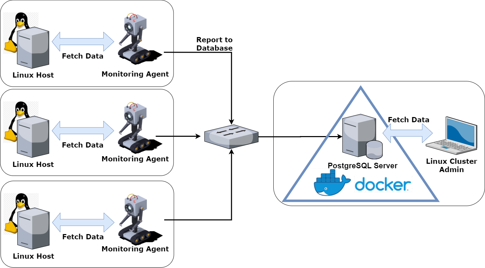

#Linux Clustering Montitoring Agent
##1.0 Introduction
This project automates the monitoring of a Linux server 
cluster's activity. Machine usage data and hardware information gets stored 
in a PostgreSQL database, which is automatically populated 
by a network of server nodes every minute. The intended
use case of this software is to help Linux Cluster
Administration teams evaluate their server cluster's
activity and compare it with their physical assets
to inform their future assets planning decisions
(e.g. adding/removing servers).

The database host setup has been automated with shell
scripts, and a .sql file has also been written that
contains common queries used by system administrators.
Moreover, we automatically configure the installation
of PostgreSQL with a shell script that
creates a Docker container containing PostgreSQL complete
with a persistent Docker volume
that stores the data managed by the PostgreSQL
instance running in the container. 

##2.0 Quick Start
###2.1 Install Docker
Before the bash scripts can be used, one must install
Docker and pull a PostgreSQL image:
```bash
sudo yum install -y yum-utils device-mapper-persistent-data lvm2

sudo yum-config-manager \
    --add-repo \
    https://download.docker.com/linux/centos/docker-ce.repo

sudo yum -y install docker-ce docker-ce-cli containerd.io

sudo groupadd docker
sudo usermod -aG docker your_username_here_to_avoid_sudo
```
The commands used to install Docker assume that a CentOS v7
Linux distribution is being used, and may differ depending
on the distribution used to implement the project.
### 2.2 Start Docker and Pull PostgreSQL
```bash
systemctl status docker || systemctl start docker
docker pull postgres
```
### 2.3 Run `psql_docker.sh` to Start PostgreSQL Container
```bash
bash psql_docker.sh create username_here password_here
bash psql_docker.sh start
```
Remember to include the correct path to `psql_docker.sh`
in the above command. This will depend on your personal
directory structure and where you currently are in your
terminal. This advice applies to all bash commands.
### 2.4 Create Database and Tables
First, connect to the PostgreSQL instance:
```bash
psql -h localhost -U postgres -W
```
You will now be in the "Read-Evaluate-Print Loop" (REPL)
of the PostgreSQL instance, and your command line prompt
should now begin with `postgres=#`. Create your database
with a CREATE DATABASE command, then exit the REPL:
```bash
CREATE DATABASE host_agent;
\q
```
Now, run `ddl.sql` to automatically set up our tables:
```bash
psql -h localhost -U postgres -d host_agent -f ddl.sql
```
### 2.5 Populating Database with Host Data
The database `host_agent` consists of only two tables, 
`host_info`, and `host_usage`. 

`host_info` contains
all the hardware specifications of each server
monitored. This table gets populated with `host_info.sh`,
which is run on every server during the initial setup
of our monitoring system. Run this script on each
server using bash:

```
bash host_info.sh psql_host psql_port db_name psql_user psql_password
```
Set the inputs as follows:
* `psql_host`: the user@IPaddress that the PostgreSQL
instance is running on
* `psql_port`: the port number of the PostgreSQL instance;
the default port is 5432
* `db_name`: host_agent
* `psql_user`: postgres
* `psql_password`: the desired login password
to the PostgreSQL instance

`host_usage ` records useful state information of the
machines that the servers are running on. Each server's 
machine must set up a "crontab" command to run 
`host_usage.sh` every minute. `host_usage.sh` adds a
record to `host_usage` containing the current usage data
of the machine whenever it is called. To set this up,
first call the crontab command:
```bash
bash crontab -e
```
This will put you into a VIM editor. Add the
following to the interface:
```
* * * * * bash <yourpath>/host_usage.sh localhost 5432 host_agent postgres password > /tmp/host_usage.log
```
Save and exit by first hitting `ESC`, then typing `:wq`, 
then hit `ENTER`. The input arguments for
`host_usage.sh` are the same as what you use for 
`host_info.sh`.

##3.0 Architecture Diagram
The figure below depicts the data flow from the Linux
cluster to the node hosting the database. Monitor agents
exist on each Linux host node, and automatically
fetch their usage data and forward it to the database.
Moreover .sql scripts can fetch data from the database,
so the data can be used by the Linux Cluster Administration
team.

##4.0 Database Modeling
In this section we describe the schema of the two tables
present in our database. 
- `host_info`

    Column Name       | Data Type  | Constraints
    ----------------- | ---------- |  -----------
    id                | SERIAL     | PRIMARY_KEY
    hostname          | VARCHAR    | UNIQUE, NOT NULL
    cpu_number        | INT        | NOT NULL
    cpu_architecture  | VARCHAR    | NOT NULL
    cpu_model         | VARCHAR    | NOT NULL
    cpu_mhz           | INT        | NOT NULL
    l2_cache          | INT        | NOT NULL
    total_mem         | INT        | NOT NULL
    timestamp         | DATE       | NOT NULL

The `l2_cache` and `total_mem` (machine's total memory)
are in units of kB. `timestamp` is a UTC compliant date
in which the host information was recorded.

- `host_usage`

    Column Name       | Data Type  | Constraints
    ----------------- | ---------- | ---------------------------
    timestamp         | TIMESTAMP  | NOT NULL
    host_id           | INT        | FOREIGN KEY (host_usage.id)
    memory_free       | INT        | NOT NULL
    cpu_idle          | INT        | NOT NULL
    cpu_kernel        | INT        | NOT NULL
    disk_io           | INT        | NOT NULL
    disk_available    | INT        | NOT NULL

`memory_free` and `disk_available` are in units of MB.
`timestamp` in this table is also UTC compliant.
`cpu_idle` and `cpu_kernel` are percentage values
(e.g. 90% is stored as 90); they represent the share of
the cpu's processing power being idle, and used by the
machine's kernel respectively.

## 5.0 Scripts
This section summarizes the files used in the 
Quick Start section.
* `psql_docker.sh`
    * This script creates a Docker container
    with a running psql instance connected to a Docker
    volume that stores the database information. One uses
    the script by using a command of the following form: 
    
        `bash psql_docker.sh [mode]` 
        
    Where `mode` can be selected 
    as `create <username> <password>`, `start`, or `stop`.
    `create` generates a Docker container running a
    PostgreSQL instance, and it accepts a custom username
    and password information as inputs. `start` and `stop`
    turn the container on and off.
* `host_info.sh`
    * This script scrapes data from a Linux system's
    `lscpu` and `/proc/meminfo` contents, and performs
    an SQL INSERT statement to the remote PostgreSQL
    instance to add a record of the server's hardware
    specifications to the `host_info` table. A detailed
    description of how to call this script has been
    provided in Section 2.5.
* `host_usage.sh`
    * This script is similar in design to host_info.sh,
    but is used for adding records to `host_usage`. This
    script makes use of `/proc/meminfo`, `vmstat`, and
    `df -BM` information sources on a Linux system to
    collect useful resource usage data and INSERT it into
    the remote PostgresSQL instance.
    
* `crontab`
    * In a Linux system, the chron daemon 
    automates the execution of scripts. `crontab` is a
    Linux command that allows one to use chron for their
    scripts. This project uses it to run host_usage.sh
    every minute; see how this is done in Section 2.5.
* `queries.sql`
    * This script contains three useful SQL queries that
    can be used to answer important business questions
    asked by the Linux Cluster Administrators.
    * The first query reports the total memory available
    for each Linux host, sorted in descending order. This
    can help the administrators understand how the cluster's
    memory assets are distributed among Linux hosts.
    * The second query reports 5-minute averages of memory
    usage in percentage form, i.e. the percentage of total
    memory used on average. If memory usage is frequently
    high, it may indicate that the Linux Cluster Administrators
    need to upgrade some hardware.
    * The third query reports the number of usage data
    records submitted by the monitoring agents of each
    Linux host in a 5-minute timeframe. Because the
    monitoring agents are supposed to send usage data
    to the database every minute, observing fewer than
    3 records in a 5-minute window can be interpreted
    as a Linux host failure. As such, this query is
    useful for detecting problems in the information
    system.  

##6.0 Improvements 
1. Currently, `host_info.sh` is manually executed when
the information system is being set up. However, to
track changes to the hardware of each Linux
host, it is required to upgrade the monitoring agent so
that it can update its host information record in the
database automatically.
2. The workflow for installing Docker and pulling the
PostgreSQL image is not automated. A bash script
that can do this would be a useful addition to the
project.
3. Designing an alert system that runs `queries.sql`
and processes its data to notify the administrators
of required hardware upgrades and system outages would
make this information system more powerful.


