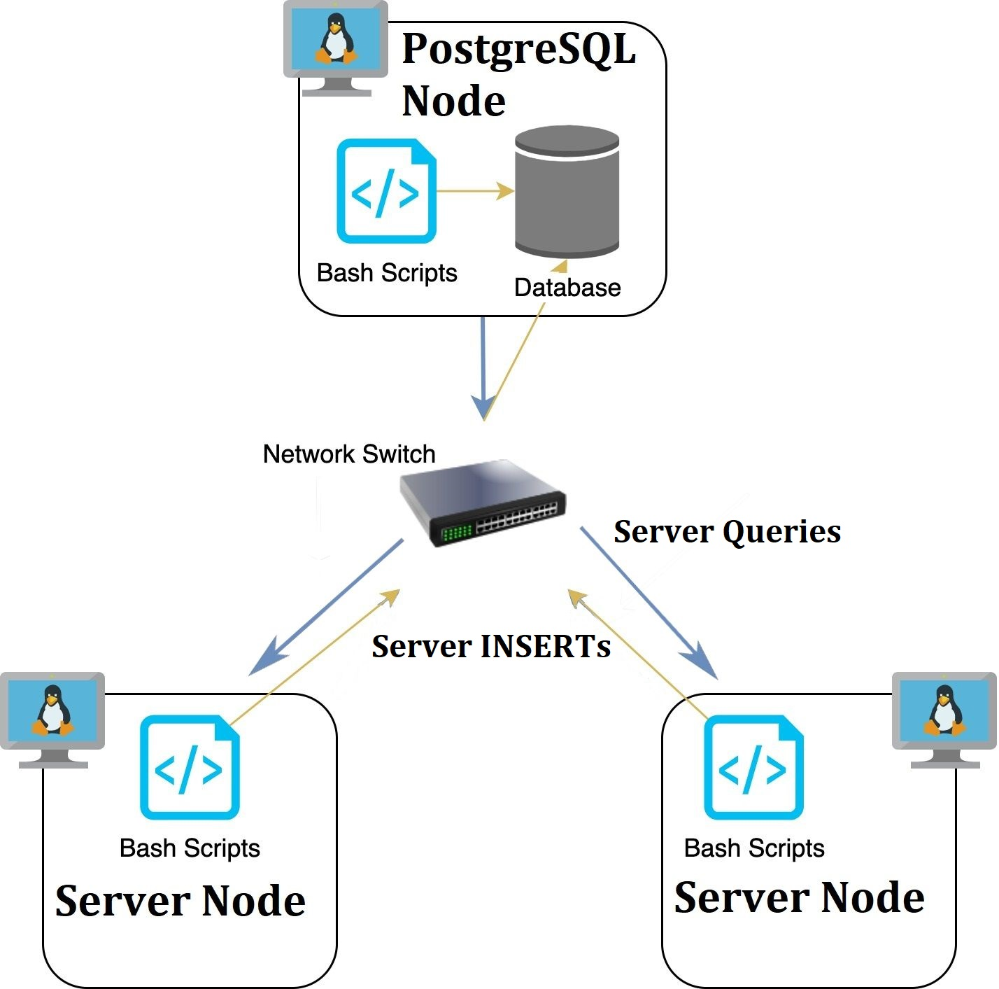

#Linux Cluster Monitoring Agent
This project automates the monitoring of a Linux server 
cluster's activity. Machine usage data gets stored 
in a PostgreSQL database, which is automatically populated 
by a network of server nodes every minute via TCP/IP 
protocols. Below is a diagram of the information system's
topology:

