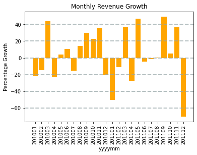
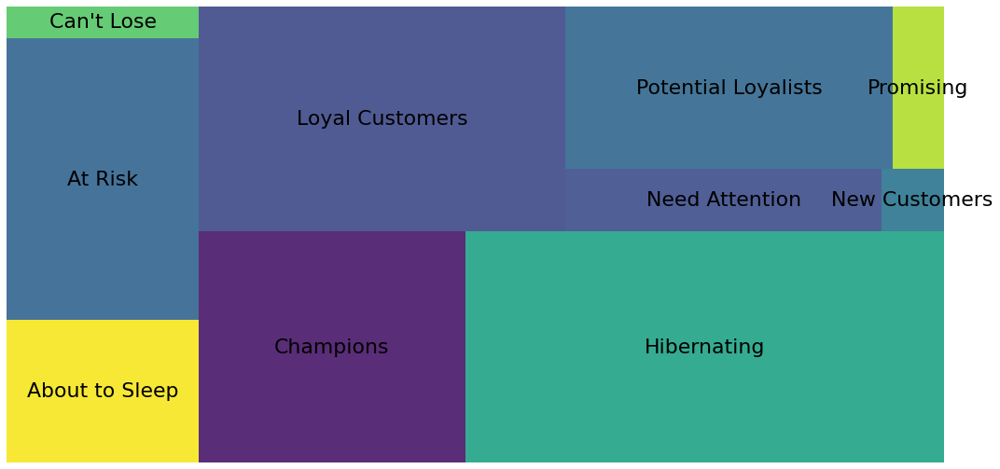

# Introduction
This project performs data analytics in Python to 
answer the business questions posed by London
Gift Shop, a UK-based online store trying to
improve the growth rate of their revenue.

Jarvis Consulting Group received two year's worth
of London Gift Shop's historical transaction data,
and was tasked to produce a proof-of-concept
analytics engine that could extract value from
the provided data.

A simple data warehouse was built using a single-table
PostgreSQL database to host the data received from 
London Gift Shop. A Python script was developed in
Jupyter Notebook to read the data from the PostgreSQL
database, and perform analytics operations. Pandas
dataframes were used for efficient processing
of the PostgreSQL data, e.g. producing summary
statistics, and performing filtering and grouping
operations. Matplotlib was also leveraged to produce
engaging box plots and histograms to visualize
trends and characteristics in the data.

Perhaps the most valuable result of this project was
the Recency-Frequency-Magnitude (RFM) breakdown of 
London Gift Shop's clientelle,
which can be leveraged to create data-driven marketing
campaigns.

# Project Architecture
Our data warehouse is designed to be intermittently 
populated with information present in London 
Gift Shop's SQL server
Online Transaction Processing (OLTP) database, i.e.
the database used to power the back end of London Gift
Shop's e-commerce web application. 

As can be seen in the
diagram below, London Gift Shop leverages Microsoft
Azure as a cloud-based solution to hardware and information
system architecture provisioning for both front and back
ends of their web application. The unstructured data used
to render their web pages 
(i.e. images, html/css/javascript files)
is managed with the Azure Blob storage solution, and
made available to clients with a Content Distribution 
System. Transactional operations executed by clients
through APIs are processed by a microservice-based
back-end application developed with Kubernetes, which
executes the requested transactions on the SQL Server
database.

Our data warehouse architecture is simple, but effective.
We have a PostgreSQL database instance that is fed information
from the live SQL Server database. The data is stripped
of personal information about the clients involved in
each transaction record prior to being loaded into
our PostgreSQL database via an Extract, Transform, Load
process. From there, our
data wrangling code developed in Python Jupyter Notebook
imports data from the PostgreSQL database as a
Pandas dataframe, and runs analytics on it.

# Data Analytics and Wrangling
The step-by-step analysis conducted on the provided
data can be accessed
[here](./retail_data_analytics_wrangling.ipynb).

A summary of the analytics performed can be
expressed visually by the plots below:

## Outlier-Filtered Distribution of Invoice Prices

This plot represents up to the 85th quantile of
invoice purchase records. The mean purchase value
for an order made by customers of this business
was calculated to be £ 271.68.

## Monthly Active Users

This plot shows a stagnant yet seasonal trend
in monthly user activity.

## Monthly Revenue

The monthly revenue appears to be correlated
to the active monthly users, which is not
surprising. Note that the vertical axis values
are in millions of pounds.

## Month to Month Changes in Revenue

## New Users Vs. Existing Users

Despite the existing users being reasonably steady,
the number of new users seem to be trending downward.

## Placed Orders Vs. Cancelled Orders

It appears as though there are many canceled orders
present in the data. Perhaps new business strategies
can be used to better close transactions.

## RFM Analysis
Based on Recency, Frequency, Magnitude (RFM) analysis,
we divided London Gift Shop's clientele into 11
categories based on how long they have gone without
buying anything (indicated by a "Recency" score);
how many purchases they have made (indicated by a
"Frequency" score); and how much they spend when they
buy things (indicated by a "Magnitude score"). All
scores range from 1-5:

- Champions [Recency = 4-5, Frequency = 4-5]
- Loyal Customers [Recency = 3-4, Frequency = 4-5]
- Potential Loyalists [Recency = 4-5, Frequency = 2-3]
- Promising [Recency = 3-4, Frequency = 0-1]
- Can't Lose Them [Recency = 1-2), Frequency = 4-5]
- At Risk [Recency = 1-2), Frequency = 3-4]
- About to Sleep [Recency = 2-3), Frequency = 1-2]
- Hibernating [Recency = 1-2), Frequency = 1-2]
- New Customers [Recency = 4-5), Frequency = 0-1]
- Need Attention [Recency = 2-3), Frequency = 2-3]

Despite calculating Magnitude scores for each
customer, we did not use Magnitude to classify
each customer.

A visual summary of the relative population sizes
of London Gift Shop's clients sorted by RFM type
has been provided below:

In our analysis, we place emphasis on 3 important
segments, namely the "Can't Lose",
 "Hibernating" and "Champions" segments.

### "Can't Lose" Segment:
Customers in this segment have not recently made 
a purchase. For this reason, we need to prepare a 
discount and gift campaign for this segment. 
These customers made a large number of purchases 
when they made purchases before. However, 
recency values are lower than they should be. 
The campaign to be implemented for these customers
 should include both items purchased and 
 recommendations based on previous activities. 
 New and popular products associated with the 
 products that they were interested in can also 
 be included in this campaign. Situations that 
 will cause these customers to stop buying need 
 to be investigated.
 
**Analysis of this Segment:**
- 85 of London Gift Shop's customers "Can't be Lost"
- The last shopping date of the customers is on average 343 days before the first day after the last day in the provided data (January 1st, 2020).
- Customers have made an average of 17.7 purchases.
- Customers spent an average of £ 5725.64.

### "Hibernating" Segment
Customers in this segment have not made a 
purchase for a long time. However, by offering 
discounts, they may be attracted to another 
purchase.

**Analysis of this Segment:**
- 1535 of London Gift Shop's customers are "Hibernating"
- The last shopping date of the customers is on average 487 days before the first day after the last day in the provided data (January 1st, 2020).
- Customers made an average of 1 purchases.
- Customers spent an average of £ 340.
    
### "Champions" Segment:
Customers in this segment are responsible for 
most of the revenue. Campaigns should be 
implemented to ensure the continuity of the 
shopping of these customers.

- 856 of London Gift Shop's customers are "Champions"
- The last shopping date of the customers is on average 30 days before the first day after the last day in the provided data (January 1st, 2020).
- Customers made an average of 24 purchases.
- Customers spent an average of £ 10510.94.
   
# Improvements
1. Expand RFM classification to include Magnitude scores
2. Develop recommendations for how to treat
the other segments aside from the three
addressed so far
3. Produce revenue forecasts