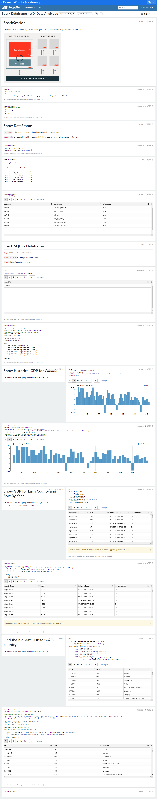

# Introduction
[Previously](https://github.com/jarviscanada/jarvis_data_eng_KevinShimotakahara/tree/master/python_data_wrangling),
Jarvis Consulting Group provided a proof-of-concept data analytics solution to London Gift Shop, an online e-commerce store
that needed data-driven insight to bolster their marketing campaigns.
Our solution imported customer transaction data into a PostgreSQL data warehouse, where it could be accessed by a Jupityr notebook
for processing with Pandas DataFrames. London Gift Shop was pleased with the results, and requested that our solution be scaled
to fit the data analytics needs of their entire company.

To do this, we could no longer assume that input data could fit into the memory of a single machine, making our
previous Pandas-based methodology no longer feasible. The solution to this problem was to 
partition large data files across a cluster of many machines, and process the partitions with distributed algorithms capable of generating
the same results as before. Fortunately, Microsoft Azure Databricks provides a Software as a Service (SaaS) solution
that can set up such a distributed computing environment for us, complete with a user-friendly notebook interface
where we can write big data analytics code in PySpark. PySpark is a Python language API for Apache Spark, which is currently the most popular
big data execution engine. With it, we can use the Spark DataFrame Structured API, which abstracts away the complicated details related to
our data being fragmented across a cluster of machines, and allows us to work with data tables in much the same way we were used to
when using Pandas.

Before delving into Databricks, we first needed to study the fundamentals of Spark; to do this, we tested the technology on the
Hadoop cluster implemented [previously](https://github.com/jarviscanada/jarvis_data_eng_KevinShimotakahara/tree/master/hadoop),
writing queries with PySpark to analyze World Development Indicator data in a Zeppelin notebook.

# Azure Databricks Implementation

## Description of Input Data
The data set we are working with in Databricks consists of two years' worth of transaction data stored in a .sql file.
Its contents have been summarized in the following table:

Field Name | Data Type | Description
---------- | --------- | -----------
invoice_no | string    | Identifies the invoice the record belongs to
stock_code | string    | Identifies the item purchased
description| string    | Describes the item purchased
quantity   | integer   | Counts how many items of the same stock_code were purchased
invoice_date | timestamp | The date and time that the transaction occurred
unit_price | float     | Unit price of item purchased
customer_id| integer   | Identifies the customer who made the purchase
country    | string    | The country the customer lives in

It should be noted that the "invoice_no" field is deliberately formatted as a string
because the values are alphanumeric despite its name implying it is just a number.

## Description of Data Analytics Workflow
The majority of the work performed in this project was writing DataFrame queries in PySpark to answer business questions related to the company's
revenue stream, purchase statistics, and customer behaviour. However, some setup was required to injest the .sql data stored in our PostgreSQL data
warehouse into our data cluster, and start using Azure Databricks for our Spark code development environment and underlying information system. The
main steps to our methodology has been listed below:

1. Extract the retail data file from PostgreSQL in CSV format
2. Subscribe to Microsoft Azure and gain access to an Azure Databricks workspace
3. Create a data cluster with the Azure Databricks Cluster UI
4. Injest the retail data CSV file into Azure Storage with the Azure Databricks Data UI
5. Design a Spark DataFrame schema for the CSV data, and save it to the Hive Metastore used by Spark to interpret source data
6. Import the source CSV data using the developed schema into a DataFrame, and perform DataFrame queries to perform the following analytics:
   * Mean, Median, Mode, Max, Min money spent by customers in a single purchase
   * Monthly volume of placed and cancelled orders
   * Monthly sales
   * Monthly sales growth    
   * Quantification of new and existing users making purchases each month    
   * Recency, Frequency, Magnitude (RFM) analysis to determine which marketing techniques should be applied to which customers based on their consumption habits

## Data Analytics System Architecture
The diagram below provides a high level overview of how the different technologies used in this project relate to one another, and how the information flows between them:

There are three main components to our information system, namely the Azure Databricks Workspace, Azure Storage, and Azure Virtual Machine. 

Azure Databricks Workspace is a manifestation of the Databricks application installed on Azure cloud computing resources. 
Databricks provides a complete solution to the setup of a big data analytics coding environment, offering a suite of user interfaces that make data ingestion and
cluster setup a point and click process. Moreover, Databricks also offers a notebook development environment complete with an underlying implementation of Apache Spark
on the automatically provisioned data clusters. Another useful component of Databricks
is the Databricks Distributed File System (DBFS), which abstracts away the implementation details of the underlying data storage mechanism used to manage the data nodes of the cluster. Through the DBFS interface, the user can find and interact with files stored on data nodes with simple path names (i.e., "dbfs:/...") regardless of what software is implementing the distributed storage system, be it a Hadoop Distributed File System, Azure Storage, S3, etc.. In our case, we are using Azure Storage.

The Spark Application is implemented by Databricks, and runs on virtual machines
belonging to a data cluster provisioned by Azure Virtual Machine. Within this data cluster, there are different Java Virtual Machines (JVMs) running that constitute the different components of the Spark Application. The Driver Process serves as the core of the Spark Application, as it maintains information about the Spark Application; responds to the user input fed to it through the Databricks notebook interface; and performs analysis on the work the Spark execution engine must perform, figuring out how to break down the work into jobs, stages, and tasks to be sent to execution nodes that operate on data partitions in the cluster. The Spark Driver makes use of a Hive Metastore to manage the table schema used to interpret the source data so it can be manipulated and represented properly by the Spark Application. The Cluster Manager manages JVM resources in the cluster, allocating them as required to the Spark Application.

## Databricks Notebook
[Link to .ipynb file](https://github.com/jarviscanada/jarvis_data_eng_KevinShimotakahara/blob/develop/spark/notebook/RetailDataAnalyticswithPySpark.ipynb) 

# Zeppelin/Spark Over YARN/Hadoop Implementation
- Describe the dataset and your analytics work (make sure you create a link to your ipynb)
- Describe the architecture (e.g. Zeppelin, GCP, Hadoop, Hive Metastore, PySpark, data flow, etc..)
- Draw an architecture diagram

## Zeppelin Notebook

# Future Improvement
- List at least three future improvements for this project
