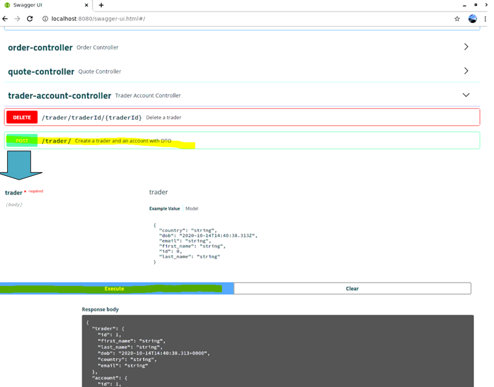
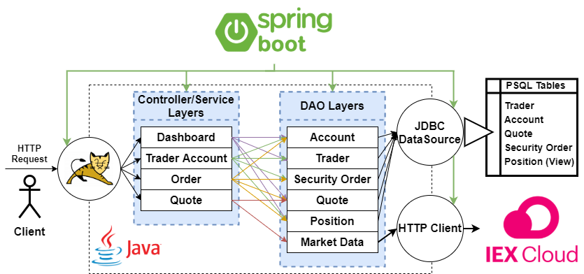
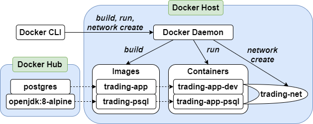

Table of contents
* [Introduction](#Introduction)
* [Quick Start](#quick-start)
* [Architecture](#Architecture)
* [REST API Usage](#rest-api-usage)
* [Docker Deployment](#docker-deployment)
* [Improvements](#Improvements)

# Introduction
This project aims to replace the Jarvis Trading Team's Security Trading Platform
(i.e. an app that facilitates online stock trading) backend with
a more scalable and maintainable implementation that leverages a microservice-based
software architecture. As a first step, this project develops a "proof of concept" REST API that
delivers the core business logic required in a securities trading application. The business logic
included in this prototype can be summarized in terms of the following functions:
- Creating and deleting trader accounts
- Withdrawing and depositing funds that can be used to buy stocks
- Querying 15-minute delayed stock information by ticker symbol from the IEX stock exchange
- Submitting market orders for buying and selling stocks
- View state of trader's profile, account, and stock portfolio

This API is intended to be used by Jarvis front end developers that
are tasked with developing its user interface to our clientele can enjoy an excellent
online trading experience. Tech-savvy traders looking to use our services to 
programmatically buy and sell stocks online are also another demographic that may find this
API useful.

This project offered a rich learning experience, allowing me to implement a microservice
based software architecture with SpringBoot. Many different technologies and software
design concepts were used to develop this application, including the following:
 - Apache Tomcat for the webapplet that maps REST requests to Java controller classes
 - Spring for dependency management
 - JUnit/Mockito for integration/unit testing
 - PSQL for storing quote and trader account/profile/portfolio information
 - JDBC for interacting with PSQL
 - Swagger to implement the web service that connects our API to a front end
 - Model View Controller design pattern
 - Maven project building framework
 - Docker for making different microservices easily re-deployable and capable of
 connecting to other microservices
 - Leveraging RESTful HTTP clients to access IEX stock data

# Quick Start

## Prerequisites
This project relies on Docker 17.05 or higher, and was
performed on a CentOS 7 Linux distribution.

Also, to access IEX quotes, you will need to obtain an IEX 
account at https://iexcloud.io/console/tokens, and take note
of your IEX Public Token. This token needs to be fed to our
application.

## Creating Dockerfiles, Images:
For ease of use, we have dockerized this application; a user
can run this project on their machine by creating and running
two Docker images `trading-app`, and `trading-psql`. 
`trading-app` runs our trading application and UI, 
while `trading-psql` generates PostgreSQL instance with our
trading application database pre-configured. When running,
the two containers communicate with the help of a user-defined
docker network bridge. 

### Step 1: Create Docker Network Bridge
A user-defined docker network bridge enables two Docker containers
to communicate with each other without needing to know their
IP address, just their container name. Setting one up can be done
in the command line:

```
docker network create --driver bridge trading-net
```

### Step 2: Build and Run `trading-psql`
You should find a Dockerfile with the following contents
in the springboot/psql directory of this project:

```
FROM postgres:9.6-alpine
COPY sql_ddl/init_db.sql /docker-entrypoint-initdb.d/
```

In the command line, navigate to this directory, and execute
the following Docker command to build the image:

```
docker build -t trading-psql .

#verify
docker image ls -f reference=trading-psql
```

To run `trading-app`, execute the following commands:

```
docker run --name trading-psql-dev \
-e POSTGRES_PASSWORD=password \
--network trading-net \
-d -p 5432:5432 trading-psql

#verify
docker ps
```

### Step 3: Build and Run `trading-app`
You should find a Dockerfile with the following contents
in the root directory of this project:
```
FROM maven:3.6-jdk-8-slim AS build
COPY src /build/src
COPY pom.xml /build/
RUN mvn -f /build/pom.xml clean package -DskipTests

FROM openjdk:8-alpine
COPY --from=build /build/target/trading-1.0-SNAPSHOT.jar /usr/local/app/trading/lib/trading_app.jar
ENTRYPOINT ["java","-jar","/usr/local/app/trading/lib/trading_app.jar"]
```

In the command line, navigate to the root directory, and execute
the following Docker command to build the image:

```
docker build -t trading-app .

#verify
docker image ls -f reference=trading-app
```

To run `trading-app`, execute the following commands:

```
#Assign environment variable your IEX Public Token value
IEX_PUB_TOKEN="your_token"

#Start container
docker run --name trading-app-dev \
-e "PSQL_URL=jdbc:postgresql://trading-psql-dev:5432/jrvstrading" \
-e "PSQL_USER=postgres" \
-e "PSQL_PASSWORD=password" \
-e "IEX_PUB_TOKEN=${IEX_PUB_TOKEN}" \
--network trading-net \
-p 8080:8080 -t trading-app
```

### Try trading-app with SwaggerUI
If everything worked in the previous steps, the application should
be running on http://localhost:8080/swagger-ui.html#. Try out
visiting this URL, and creating a trader account:



# Architecture
Below is a diagram of the trading application's architecture. We implement
an MVC design pattern to organize our Java code into manageable system components.
To use our software, a client makes a RESTful HTTP request through our web
application. This Http request is then handled by Apache Tomcat, and depending
on the endpoint, sends its details to the appropriate controller class that can
process the request. Moreover, we use Spring framework to manage all the
dependencies in our project. The configuration of both Apache Tomcat and Spring
dependency injection (IoC) is automatically performed with SpringBoot
"starter projects", which are imported as Maven dependencies.

Every controller component has a corresponding identically named service layer
component that it defers the execution of business logic to. Because of this,
the diagram lumps the two layers together to make the diagram easier to follow.
For example, the diagram indicates that our software includes both an "Order"
controller, and an "Order" service. The service components then use different
combinations of Data Access Object (DAO) components as indicated in the diagram.
Almost all DAO components interact with our PSQL database via a JDBC driver,
except for the Market Data DAO that interacts with the IEX's REST API via
an HTTP client.



## Controller Layer
The controller layer is injected with data contained
within incoming REST requests via Spring annotations.
With this data, it can call the service layer to perform
the required business logic. Moreover, through Spring
annotations, the controllers can return the objects
received by the service layer as the body of the HTTP
response that is to be sent back to the client. At this
stage, again through Spring annotations, various status
code logic and notes get configured as well.

## Service Layer
The service layer does not need to worry about interfacing
with the user input (i.e. HTTP request), and performs
the business logic demanded by the controller layer.
This business logic involves checking if the request is
valid; deciding what data and operations are required to
fulfill the request; and providing to the controller layer 
anything required for the body of the HTTP response.
If data repositories need to be queried/updated, the 
service layer calls upon the appropriate DAO object(s)
to perform such operations on their behalf.

## DAO Layer
The Data Access Object layer interacts with two different data sources,
namely our PSQL database and the IEX REST API. Our PSQL database contains four
tables and one view:
- The **quote** table contains saved stock quote information pulled from IEX.
- The **trader** table contains the personal information of a user of our trading
application.
- The **account** table contains all investment accounts held by the traders.
- The **security order** table lists all market orders made by the traders, and
their status (i.e. open or filled).
- The **position** view is a query of the security order table that summarizes
how many shares of each stock are held by which traders.

The IEX REST API is used to fetch recent quotes for different stocks traded on their
platform; the most relevant information is filtered from this API and stored as a
record in our PSQL quote table.


# REST API Usage
## Swagger
Swagger is an Interface Description Language for representing
RESTful APIs with JSON files. Swagger is used to facilitate the 
design, building, documentation, and use of
RESTful web services. Swagger includes automated documentation, 
code generation, and test-case generation.

This project makes use of Swagger UI, which allows anyone 
to visualize and interact with the API's 
resources without having any of the implementation logic in 
place, benefiting those performing back end implementation and 
client side consumption.

## Quote Controller
The quote controller manages stock quote information used by
this application. It performs a multitude of tasks related to
fetching relevant stock information from the IEX, and either
viewing it directly or storing it in the quote table of our
PostgreSQL database for future use. Below is a sample of an
Apple stock quote record that was generated by the quote 
controller:

```
{
  "ticker": "aapl",
  "lastPrice": 121.13,
  "bidPrice": 121.13,
  "bidSize": 500,
  "askPrice": 122,
  "askSize": 100,
  "id": "aapl"
}
```

### Endpoint Summary
  - GET `/quote/dailyList`: List all securities that are available for
   trading in this trading system.
  - POST `/quote/tickerId/{tickerId}`: Add a new ticker to the dailyList.
  - GET `/quote/iex/ticker/{ticker}`: Observe unfiltered quote data fetched
  directly from IEX REST API.
  - PUT `/quote/iexMarketData`: Update quote table using IEX quote information.
  - PUT `/quote/`: Update a given quote in the quote table manually (i.e. not
  by using IEX quote information directly); this endpoint is for 
  debugging and testing purposes.

## Trader Controller
The trader controller manages trader and account 
information. The controller can perform four operations:
1. Create a trader and account
2. Delete a trader and account
3. Withdraw funds from a trader's account
4. Deposit funds to a trader's account

It should be noted that this app currently limits each
trader to having only one account, and that to delete
a trader account, the trader must have an account balance
of 0, and own no stocks.

### Endpoint Summary
- POST `trader/*`: There are two endpoints that can create
 a new trader. The first allows you to create a new trader 
 using an HTTP request body, and the other one allows you 
 to use a URL. (Note: `dob` field uses yyyy-mm-dd format)
- PUT `/trader/deposit/traderId/{traderId}/amount/{amount}`: 
 Deposit funds (amount) into specified trader account (traderId).
- PUT `/trader/withdraw/traderId/{traderId}/amount/{amount}`:
 Withdraw funds (amount) from specified trader account (traderID).
- DELETE `/trader/traderId/{traderId}`: Delete a trader
and their account. Trader must have no assets when this
request is sent.

##Order Controller
The order controller is used to place market orders to
buy/sell securities. At the moment, we simulate market
orders by generating a security order record that is
immediately filled with the current price stored in
our quote table. The trader issuing the market order has
their account balance updated accordingly.

### Endpoint Summary
- POST `/order/marketOrder`: Accepts an orderDto and places
the order that it specifies. orderDto format:

```
{
id	integer($int32)
size	integer($int32)
ticker	string
type	string
}
```

## Dashboard controller
The dashboard controller is used to observe trader and
account information, in addition to a trader's stock
portfolio.

### Endpoint Summary
- GET `/dashboard/portfolio/traderId/{traderId}`: Show portfolio by trader ID.
- GET `/dashboard/profile/traderId/{traderId}`: Show trader profile by trader ID.

# Docker Deployment
The workflow involved in setting up our application via
Docker is visualized in the following diagram. Ultimately,
we produce two Docker containers connected by a Docker
network bridge; one container contains our Java application,
and the other container contains our PostgreSQL instance
that hosts our database.



In general, to run a Docker container, one must first
build a Docker image. A docker image is a skeleton of a
virtual operating system, consisting of a file that 
contains a preconfigured Linux file system and its contents.
A virtual computer environment is generated with this image
along with your real machine's kernel, and recreates only 
the portions of an OS that are needed for the specific 
process you have created it for. A running instance of
the image is considered the "container" which is executing
the process we are "containerizing". Docker images are
created by building a Dockerfile, which contains Docker
commands used to configure the image.

Usually, Dockerfiles/images are not built from scratch, but add a few
new commands to a base image pulled from Docker Hub. For
instance, instead of having to start the setup of a Linux
file system that has a Java Development Kit installed on it
from scratch, we can build off the `openjdk:8-alpine`
image available on Docker Hub. This is exactly what was
done in this project for our `trading-app` image; when
starting with `openjdk:8-alpine`, we only needed to
execute a few Maven commands to build our application
within a `maven:3.6-jdk-8-slim` image, and then inject
the .jar file produced into the `openjdk:8-alpine` base
image. See Quick Start for the Dockerfile code used to
do this.

Similarly, we did not have to create our `trading-psql`
image from scratch. The base image `postgres:9.6-alpine`
already sets up a Linux distribution and installs psql
within it so we don't have to. All we have to do is
initialize our database and its tables, and this is
made especially easy with our choice of base image, as
it has a special directory `docker-entrypoint-initdb.d`
that automatically runs .sql and .sh files on image
startup, so we simply placed a .sql configuration script
in that directory with a single command in the Dockerfile:

`COPY sql_ddl/init_db.sql /docker-entrypoint-initdb.d/`

Once the Dockerfiles are written, the Dockerization
workflow becomes more straightforward. Through the CLI,
we use a Docker "build" command to create an image file
using a Dockerfile, and then a "run" command to generate
a container. Prior to running containers however, we
need to set up a Docker network so our containers can
communicate to one another; this is done with a Docker
"network create" command. The specific details involved
in executing these statements are provided in the Quick
Start Guide.

# Improvements
Below is a list of five improvements that should be added to
this proof of concept application:
1. Currently, our clients can only place market orders when
buying/selling stocks; however, limit orders are a more popular
option among short term traders, and should be offered by this
application.
2. It would be nice to offer a passively managed index mutual
fund for our traders; we could implement a "bot" trader account
that regularly scans the IEX market for stocks to best mirror
the market index with its positions, and then extend our REST
API for users to buy/sell percentage ownerships of the bot account,
whose value will be proportional to the overall value of the
bot's portfolio.
3. We could provide the users with more information on the
stocks they own, e.g. growth rate, market value vs. book value,
etc.
4. To support international clients, we could offer accounts that
trade in different currencies.
5. For simplicity, this project currently assumes that
every trader has only one account, and its ID is the same
as their trader ID. The code should become more generalized,
and be able to handle traders with multiple accounts with
ID values that are independent of trader ID.